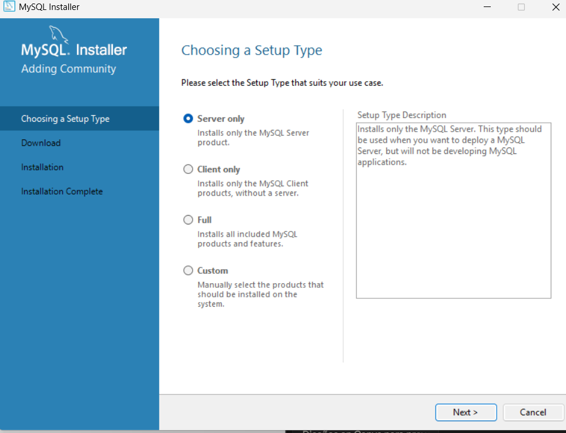
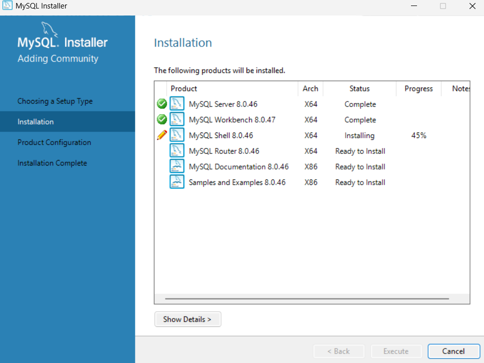
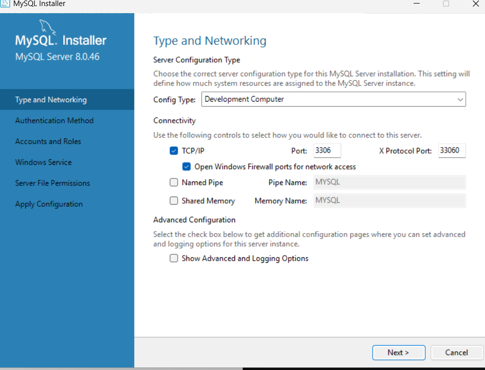
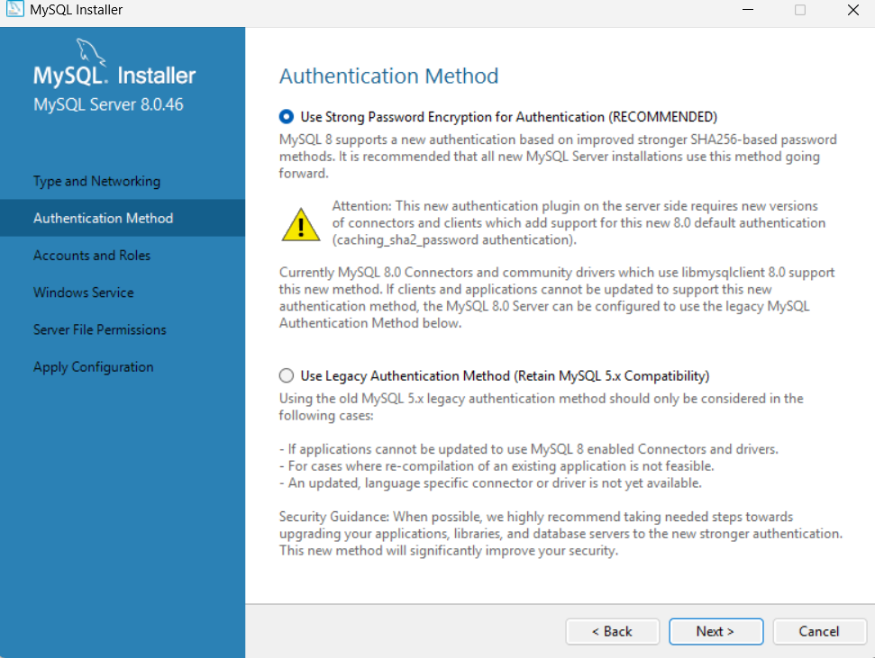
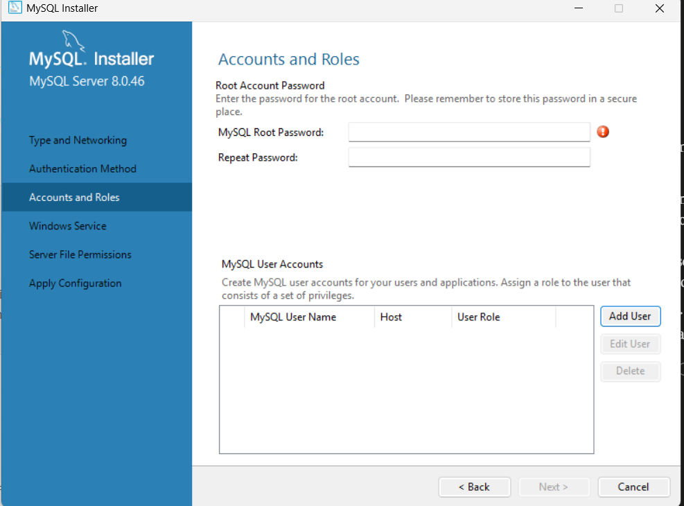

# 🐬 Instalación y Configuración de MySQL

## 👤 Información del Estudiante

| Campo | Detalle |
|---|---|
| **Nombre completo** | Daniel (tu apellido aquí) |
| **Programa** | Técnico en Desarrollo Frontend |
| **Institución** | CampusLands |
| **Sistema Operativo** | Windows 11 |

---

## 📋 Descripción General

Este repositorio documenta el proceso de instalación de **MySQL Server** y **MySQL Workbench** en Windows, como parte de la configuración del entorno de desarrollo local. La instalación permite gestionar bases de datos relacionales de forma local y validar conexiones mediante sentencias SQL.

---

## ⚙️ Proceso de Instalación

### Paso 1 — Elección del tipo de instalación

Al ejecutar el instalador de MySQL, se presenta la pantalla **"Choosing a Setup Type"** con cuatro opciones. Se seleccionó la opción **"Full"** para instalar todos los componentes incluidos: MySQL Server, MySQL Workbench, MySQL Shell, conectores y documentación.



> Se eligió **Full** para garantizar que MySQL Workbench quedara instalado junto con el servidor, ya que la opción "Server only" no lo incluye.

---

### Paso 2 — Instalación de los componentes

El instalador descargó e instaló cada producto de forma automática. En esta pantalla se puede ver el progreso de instalación de cada componente:

- ✅ **MySQL Server 8.0.46** — Complete
- ✅ **MySQL Workbench 8.0.47** — Complete
- 🔄 **MySQL Shell 8.0.46** — Installing (45%)
- ⏳ **MySQL Router, Documentation, Samples** — Ready to Install



> Esta pantalla confirma que tanto el servidor como Workbench se instalaron correctamente antes de continuar con la configuración.

---

### Paso 3 — Configuración de red (Type and Networking)

Se configuró el tipo de servidor y la conectividad. Los valores utilizados fueron:

- **Config Type:** Development Computer
- **Protocolo:** TCP/IP activado
- **Puerto:** 3306 (puerto estándar de MySQL)
- **X Protocol Port:** 33060



> No se modificó ningún valor por defecto. El puerto **3306** es el estándar de MySQL y debe mantenerse para evitar conflictos con otras herramientas.

---

### Paso 4 — Método de autenticación

Se seleccionó el método de autenticación recomendado por MySQL 8: **"Use Strong Password Encryption for Authentication (RECOMMENDED)"**, basado en el algoritmo SHA-256.



> Esta opción es más segura que el método legacy de MySQL 5.x y es totalmente compatible con MySQL Workbench 8.x.

---

### Paso 5 — Configuración de credenciales (Accounts and Roles)

En la pantalla **"Accounts and Roles"** se definió la contraseña del usuario administrador **root**. Este usuario tiene acceso total al servidor MySQL.


> ⚠️ La contraseña del usuario `root` es crítica. Se debe guardar en un lugar seguro ya que se requiere en cada conexión desde MySQL Workbench.

---

### Paso 6 — Apertura de MySQL Workbench y conexión local

Al finalizar la instalación, se abrió **MySQL Workbench**. En la pantalla principal aparece automáticamente la conexión **"Local Instance MySQL80"**, que apunta al servidor local en el puerto 3306.




---

## ✅ Validación del Entorno

Para confirmar que MySQL Server está funcionando correctamente, se ejecutó la siguiente consulta en una pestaña de **Query** dentro de MySQL Workbench:

```sql
-- Consulta de validación de entorno
SELECT VERSION() AS 'Versión de MySQL', 
       CURRENT_USER() AS 'Usuario Actual', 
       NOW() AS 'Fecha y Hora del Servidor';
```

### Resultado obtenido


La consulta retornó:
- ✅ La **versión instalada** de MySQL Server
- ✅ El **usuario actual** conectado (`root@localhost`)
- ✅ La **fecha y hora** del servidor en tiempo real

---

## 📁 Estructura del Repositorio

```
📦 mysql-instalacion/
 ┣ 📂 img/
 ┃ ┣ 🖼️ captura_1.png   → Elección del tipo de instalación (Full)
 ┃ ┣ 🖼️ captura_2.png   → Instalación de componentes en progreso
 ┃ ┣ 🖼️ captura_3.png   → Configuración de red y puerto 3306
 ┃ ┣ 🖼️ captura_4.png   → Método de autenticación SHA-256
 ┃ ┣ 🖼️ captura_5.png   → Configuración de contraseña del root
 ┃ ┗ 🖼️ captura_6.png   → MySQL Workbench con conexión local
 ┗ 📄 README.md
```

---

## 🛠️ Herramientas Utilizadas

- **MySQL Server 8.0.46** — Motor de base de datos relacional
- **MySQL Workbench 8.0.47** — Cliente visual para administración de MySQL
- **Sistema Operativo** — Windows 11